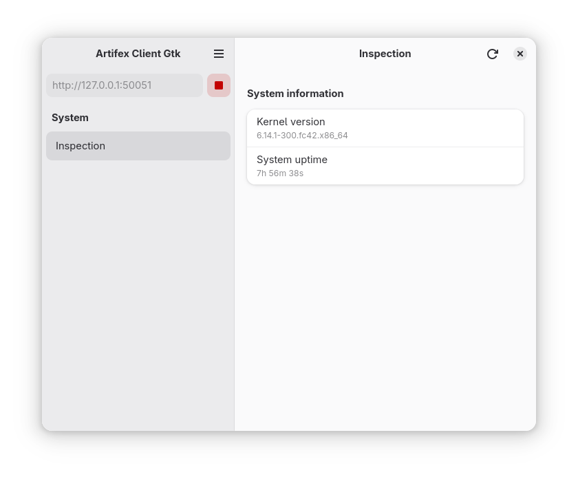

# artifex-client-gtk

This is a GTK-based client to interact with an [Artifex][artifex] server over [gRPC][GRPC].

This project is *FOR EDUCATION, NOT PRODUCTION*.

## Screenshots

<div align="center">



</div>

## Requirements

- [Meson](http://mesonbuild.com/)
- [Ninja](https://ninja-build.org/) (version 1.7 or newer)
- [Rust](https://rust-lang.org)

## Installation

To configure and build the project, execute:

```sh
mkdir _build
meson setup --buildtype=release . _build
meson compile -C _build
```

To install the tools to system directories, execute:

```sh
meson install -C _build
```

To install to a specific directory (e.g. ``$HOME/.local``), add
``--prefix=$HOME/.local`` to ``meson setup`` command.

## Packaging

To distribute this application using [Flatpak](https://flatpak.org/), execute:

```sh
flatpak remote-add --user --if-not-exists flathub https://flathub.org/repo/flathub.flatpakrepo
flatpak install --user flathub org.gnome.Sdk//48
flatpak install --user flathub org.freedesktop.Sdk.Extension.rust-stable//24.08
flatpak install --user flathub org.freedesktop.Sdk.Extension.llvm18//24.08
flatpak-builder --user _flatpak build-aux/com.elebihan.artifex-client-gtk.Devel.json
```

## License

Copyright (c) 2025 Eric Le Bihan

This program is distributed under the terms of the MIT License.

See the [LICENSE](LICENSE) file for license details.

[artifex]: https://github.com/elebihan/artifex
[GRPC]: https://grpc.io
